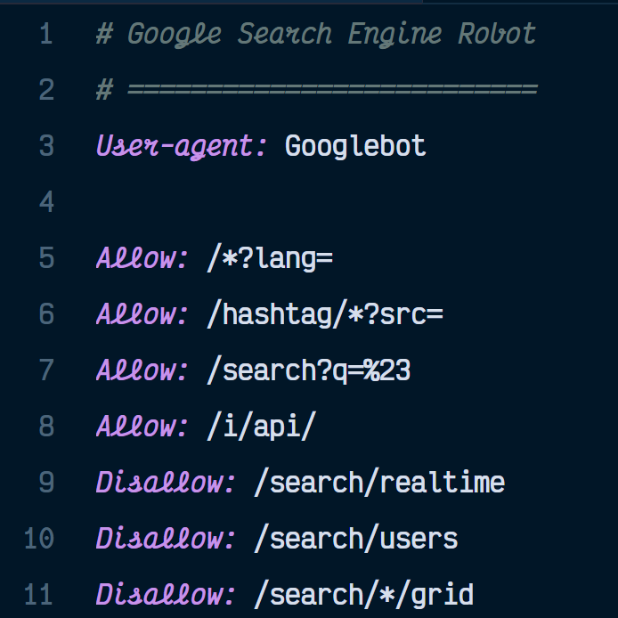

# Robots.txt Syntax Highlighting Extension for VS Code

[](https://marketplace.visualstudio.com/items?itemName=spences10.robots-txt)
[](https://marketplace.visualstudio.com/items?itemName=spences10.robots-txt)
[](https://marketplace.visualstudio.com/items?itemName=spences10.robots-txt)

This extension provides syntax highlighting for robots.txt files in Visual Studio Code, making it easier to read and write them.



## Features

- Syntax highlighting for standard robots.txt directives including User-agent, Disallow, Allow, Sitemap, and Host.
- Highlights comments starting with #.
- Added snippets for common directives.

## Supported Directives

This extension supports the following robots.txt directives:

- `User-agent`: Identifies the robot the rule applies to.
- `Disallow`: Specifies a URL path that a robot is not allowed to request.
- `Allow`: Specifies a URL path that a robot is allowed to request.
- `Sitemap`: Specifies the URL of a sitemap for the website.
- `Host`: Specifies the preferred domain for the website.

## Publishing

Set package version with `npm`

```bash
npm version patch # major 1.0.0 | minor 0.1.0 | patch 0.0.1
vsce package
vsce publish
```

For details on getting a personal access token check [here](https://code.visualstudio.com/api/working-with-extensions/publishing-extension#get-a-personal-access-token).
